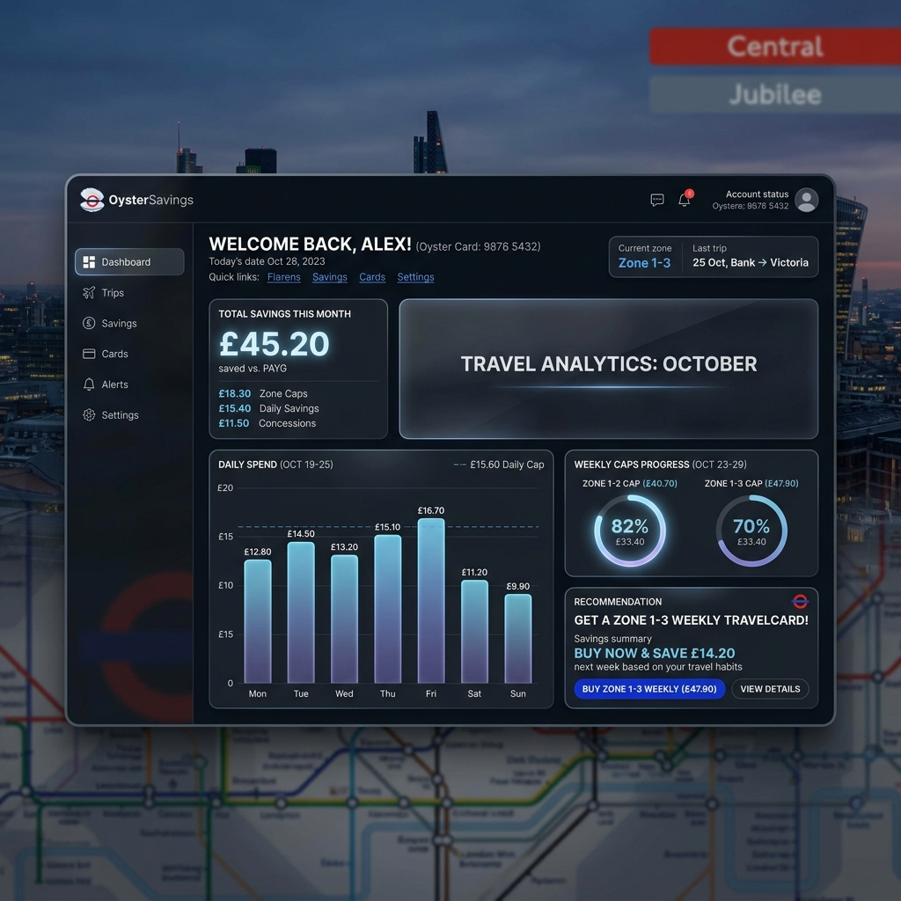
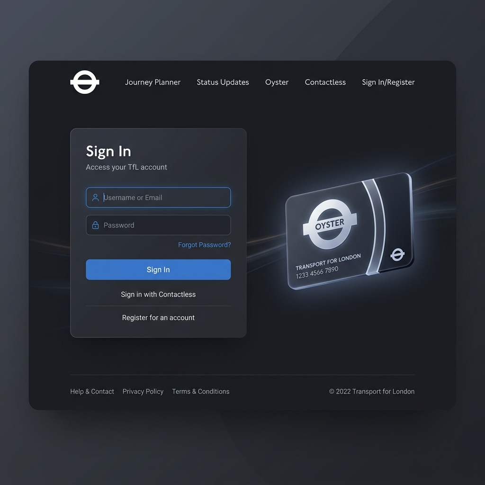
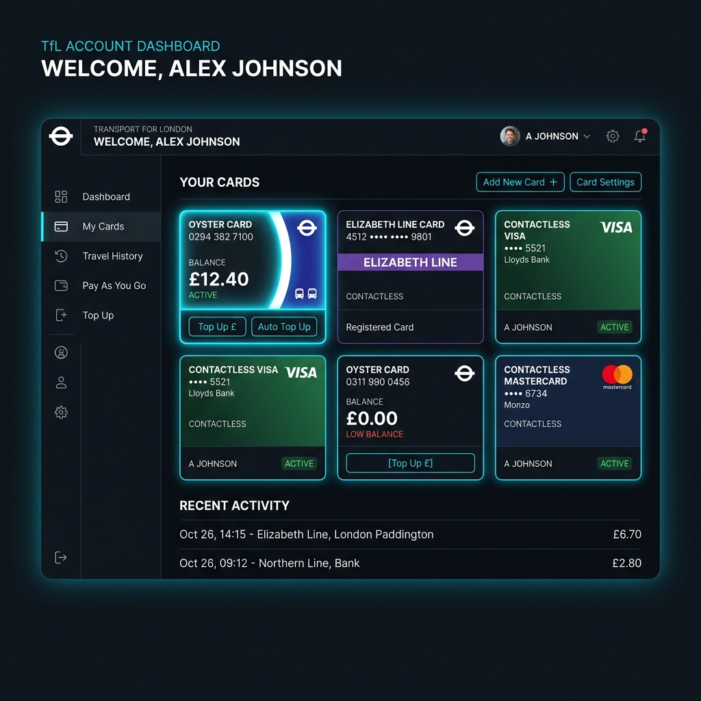
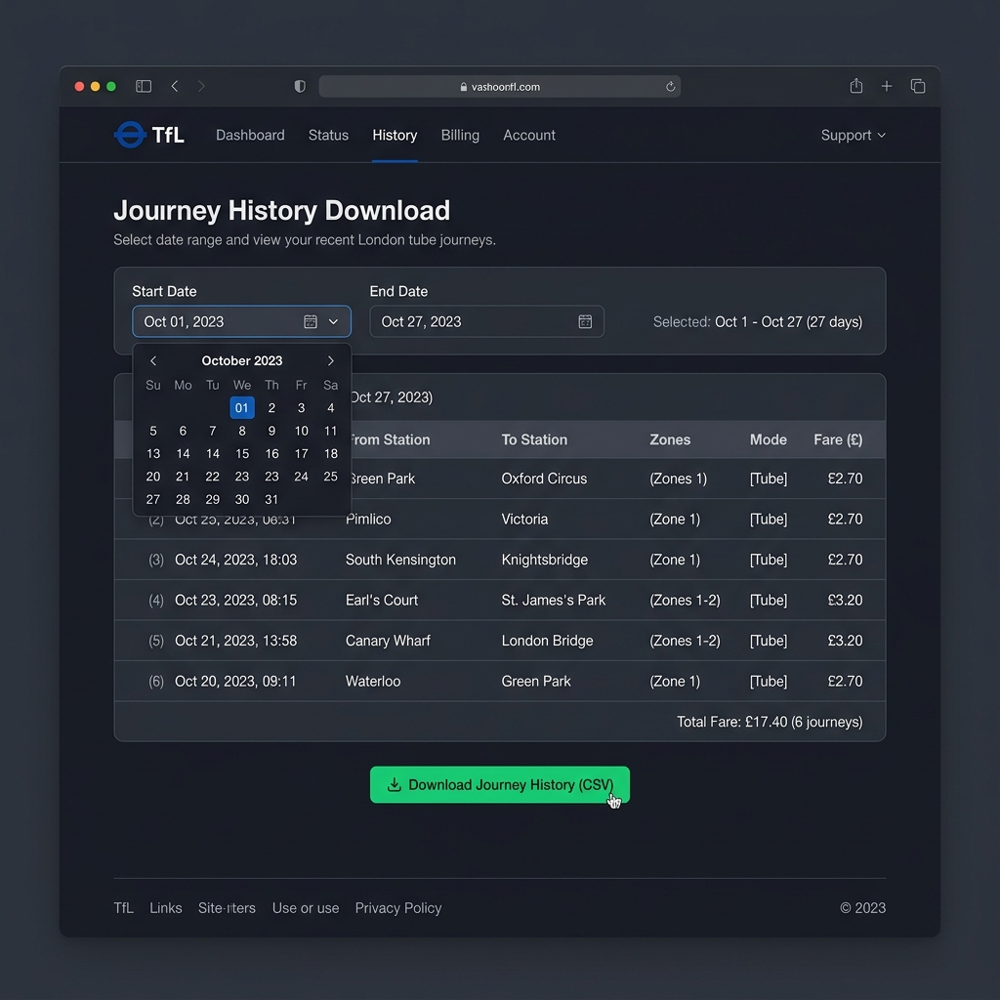

# 🦪 OysterSavings — TfL Fare & Discount Optimizer

OysterSavings is a privacy-first, TfL-inspired dark glassmorphism web application designed to help London commuters analyze their historical travel data, simulate future commutes, and identify the most cost-effective ticket types (PAYG, weekly/monthly/annual Travelcards, and Railcards).



---

## 🌟 Key Features

### 1. Interactive TfL CSV Walkthrough & Loader
Instead of exposing immediate upload boxes, the landing page uses a **Generate Analysis** flow to guide users step-by-step through requesting their travel data from the official TfL contactless or Oyster portal.
- **Verbatim step guidelines** with mockups showing exactly where to click.
- Supports standard TfL Oyster and contactless account CSV history exports.
- Offers a quick **Browse Demo Profiles** card to instantly explore the dashboard using pre-configured commuters (Sarah, James, Chloe, Marcus, Amir).

| Step 1: Sign In | Step 2: Select Card | Step 3: Export CSV |
| :---: | :---: | :---: |
|  |  |  |

### 2. Deep Fare & Savings Analysis
- **Daily Cap Analytics**: Track how many days you hit the TfL daily cap and how much you saved.
- **Filter and Classifier**: Auto-excludes failed taps, duplicates, or system refunds, and classifies trips by transport mode (Underground, Overground, Rail, Bus).
- **Missed Discount Finder**: Estimates prospective savings from Railcards (16-25, 26-30, Senior, etc.) or Oyster photocards.

### 3. Future Commuter Routine Planner
- Allows users to model their weekly commutes (origin/destination zones, specific time periods, and transport modes).
- Generates a future travel forecast, recommending whether a weekly or monthly card fits their budget.

### 4. Product Comparison Engine
- Cross-compares Pay-As-You-Go (PAYG) costs, weekly Caps, and weekly/monthly/annual Travelcards across specific zone ranges to identify exactly where your money goes.

---

## 🔒 Privacy & Data Processing Breakdown

OysterSavings is built with a **100% local, privacy-first architecture**:
*   **Zero Server Communication**: Your travel history CSV never leaves your browser. All calculations, classification, and visualizations are performed entirely on the client side.
*   **No Tracking or Cookies**: The application does not load tracking scripts, Google Analytics, or external marketing pixels.
*   **No DB Persistence**: Once you reload or click "New Upload", the parsed state is wiped from memory.

---

## 🛠️ How to Compile and Run Locally

Ensure you have [Node.js (v18 or higher)](https://nodejs.org/) installed.

### 1. Install Dependencies
Clone the repository and install the npm dependencies:
```bash
git clone https://github.com/NotToxel/OysterSavings.git
cd OysterSavings
npm install
```

### 2. Start Local Development Server
Launch the development server with Vite:
```bash
npm run dev
```
Open [http://localhost:5173](http://localhost:5173) in your browser to view the application.

### 3. Production Build & Compilation
Compile and build a highly-optimized client and server bundle:
```bash
npm run build
```

### 4. Preview the Production Build
Validate the compiled production build locally:
```bash
npm run preview
```

---

## 📦 Tech Stack & Acknowledgements

We acknowledge and thank the creators of the open-source libraries that make OysterSavings possible:
*   **Framework**: [Svelte 5](https://svelte.dev/) & [SvelteKit](https://svelte.dev/docs/kit) - For state management and reactivity.
*   **Styling**: [TailwindCSS v4](https://tailwindcss.com/) - For modern responsive utility tokens.
*   **Compilation**: [Vite](https://vite.dev/) & [TypeScript](https://www.typescriptlang.org/) - For bundling and type safety.
*   **Parser**: [PapaParse](https://www.papaparse.com/) - For high-performance CSV processing.
*   **Charts**: [Chart.js](https://www.chartjs.org/) - For clean, responsive rendering of daily travel statistics.

> [!NOTE]
> **Dependencies & Documentation Policy**: The project configuration and this documentation are actively maintained to be fully up-to-date with package upgrades, Svelte runes, and styling enhancements.

---

## 📄 License

This project is licensed under the **GNU Affero General Public License, Version 3 (AGPL-3.0)**. 
- You may copy, modify, and distribute this software.
- If you run a modified version of this software as a network service, you **must make the source code publicly available** under the same license.
- See the [LICENSE](LICENSE) file for the full legal text.
