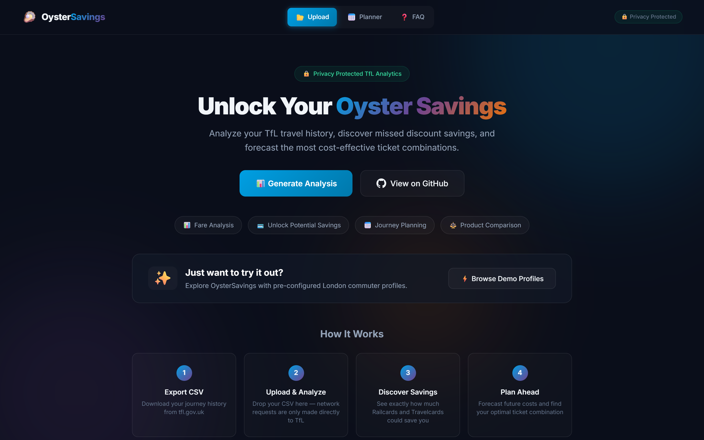
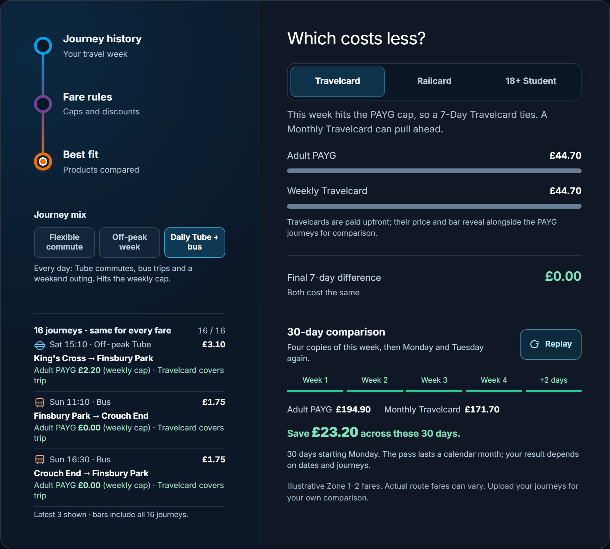
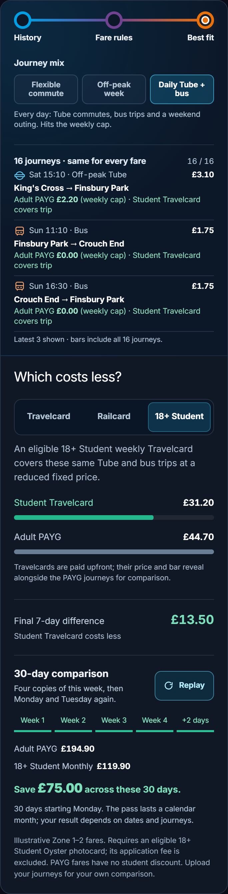
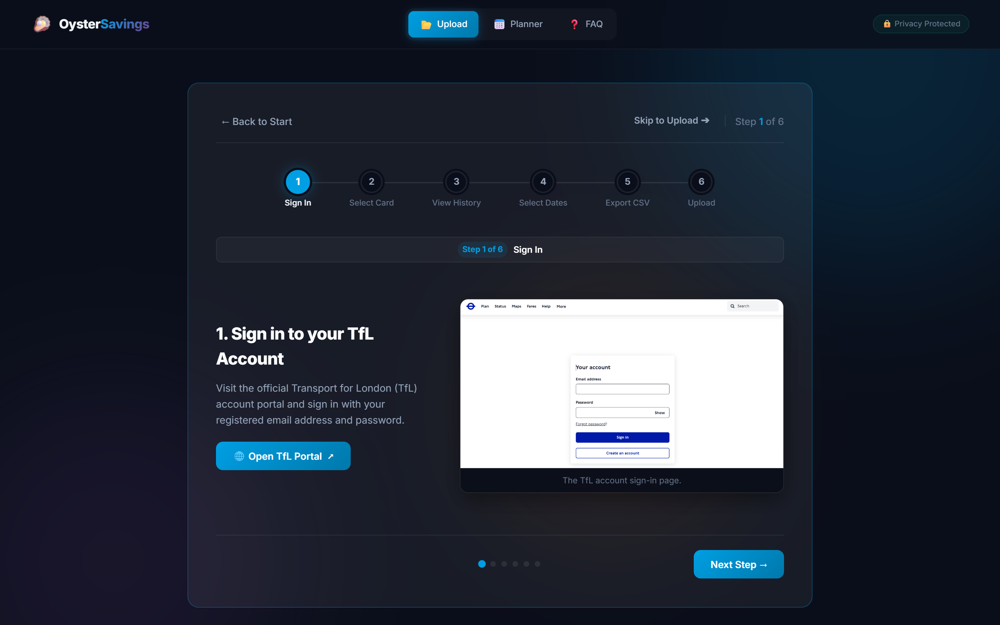
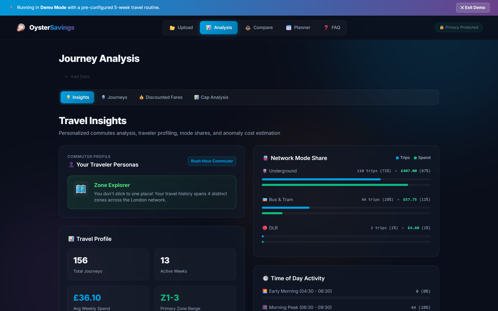
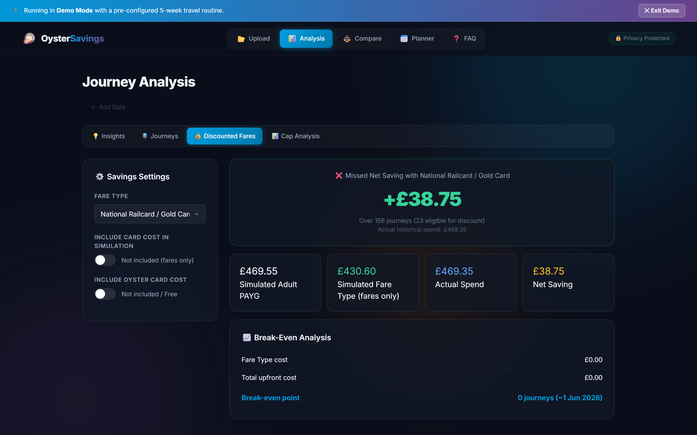
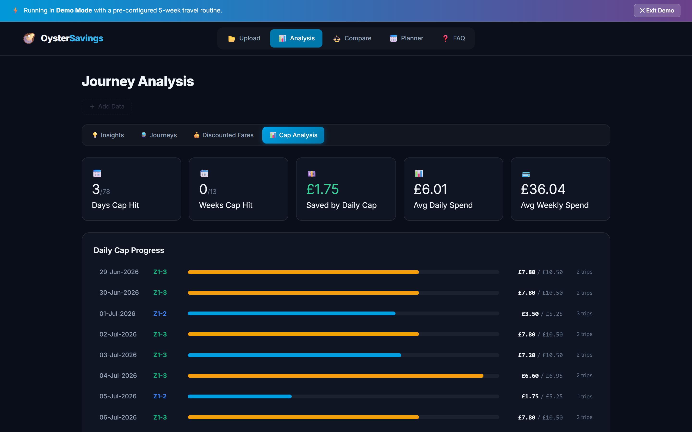
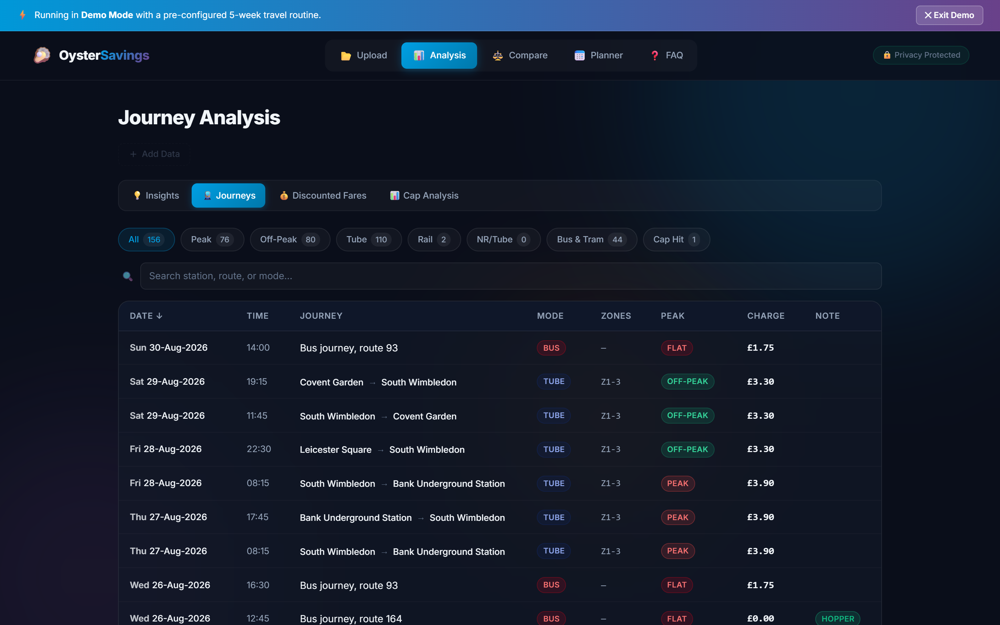
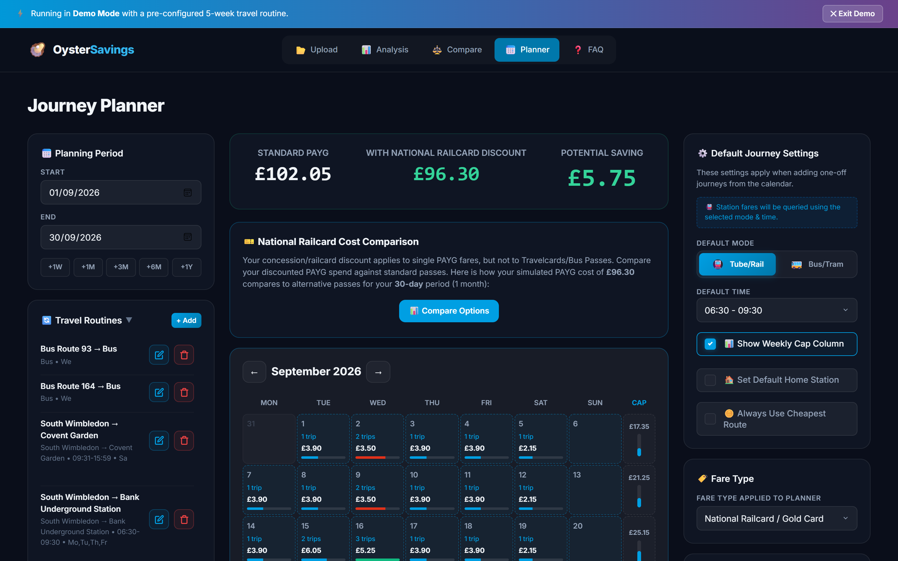
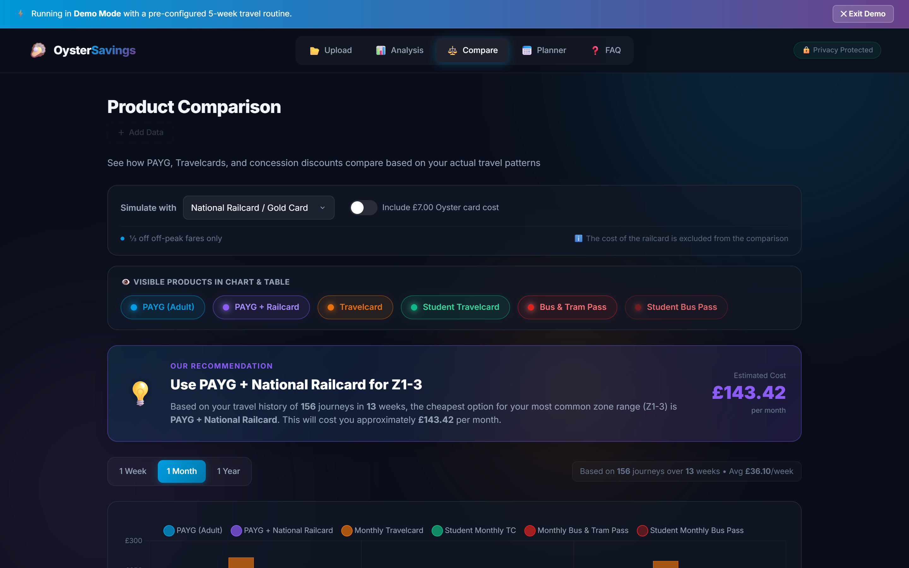

# OysterSavings

OysterSavings helps London travellers compare pay as you go, caps, Railcard discounts and Travelcards against their journeys. It is a privacy-first Svelte 5 app: travel-history CSV analysis runs in your browser.



## Explore the fare comparison

The homepage includes an interactive, illustrative journey preview. Choose a flexible commute, an off-peak week or daily Tube and bus travel, then compare the **same transactions** under adult PAYG, a linked Railcard, a weekly Travelcard or an eligible 18+ Student Travelcard. Journey charges and price bars build together; the weekly difference appears only after the final trip. The daily Tube and bus example also shows how a Monthly Travelcard can compare over 30 days. Replay is available when the sequence finishes.

These examples explain the comparison, not quote a fare for your own travel. Upload your TfL history or use the planner for a personal result.



The same preview is designed for smaller screens:



## Analyse your own travel

1. Select **Generate Analysis** to follow the guided TfL history-export and CSV-upload flow. OysterSavings supports Oyster and contactless history exports.
2. Or load a demo commuter profile to explore the dashboard without a file.
3. Review journey patterns, missed discounts, cap usage and a filterable journey log.
4. Use the planner to compare future routines and ticket products. Station-to-station fare lookups go directly to the official TfL API.



### Dashboard views

| View | What it shows |
| --- | --- |
| Insights | Travel patterns, commuter personas and time-of-day activity |
| Discounted fares | Historical comparison with eligible concessions and Railcards |
| Cap analysis | Daily and weekly cap usage |
| Journeys | Filterable, mode-classified transactions |






### Plan and compare

Model recurring and one-off journeys, choose a fare profile and compare PAYG against Travelcards for the relevant period.




## Privacy

- CSV parsing and fare-product comparisons run locally in the browser. Raw travel history is not uploaded to an OysterSavings server.
- The app has no analytics trackers or third-party scripts. Station fare lookups use the official TfL API directly.
- Parsed travel history is held in browser memory for the session; reloading or starting a new upload clears it.

## Run locally

Requires Node.js `^20.19.0` or `>=22.12.0` and npm.

```bash
git clone https://github.com/NotToxel/OysterSavings.git
cd OysterSavings
npm install
npm run dev
```

Open the local URL printed by Vite. For validation and a production build:

```bash
npm run check
npm run build
npm run preview
```

Regenerate the README screenshots with `npm run screenshots`. The script launches a local Vite server and saves images to `static/images/readme/`.

## Built with

Svelte 5, SvelteKit, TypeScript, Vite, Tailwind CSS, PapaParse and Chart.js. All app scripts and assets are bundled locally.

## License

OysterSavings is licensed under [AGPL-3.0](LICENSE).
